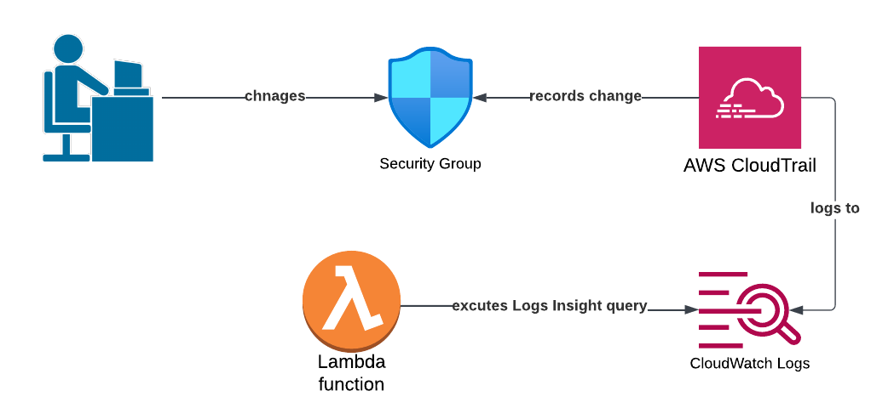

# cloudtrail-log-insights

This Terraform script sets up a Lambda function to execute an Amazon Cloudwatch Log Insights query to find occurrences of any security group rule changes in CloudTrail logs.  CloudTrail is set up to send it's logs to CloudWatch.  The Lambda is written in Python and looks for certain fields in relevant logs.  It simply prints the result.  I found that the resulting JSON not to be in a particularly useful format for ingestion by another service (see sample_log_insights.txt).  I had difficulty getting Log Insights to simply print a JSON string as a value for a displayed field.  It would be useful to see the requestParameters JSON to find details of the security group.  In any event, this field can be parsed to extract and display individual values.  I did not go this far as needs would be situation-specific.

This is potentially useful way to parse Cloudtrail logs but is a pull-based system which needs more automation (to execute the Lambda occasionally).

To experiment with this Terraform script, apply it, make some security group rules changes and then manually execute the Lambda.

